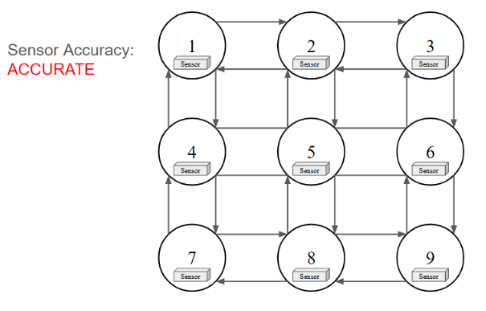

# Dissertaion Experiment Code
Evaluation code for my dissertation on developing a framework for self adaptive systems to limit epistemic uncertainty. The framework proposes the use of a digital twin that evaluates a multiplicity of adaptive models based on environmental factors detected by the real system. 

The evaluation builds on Adasim, a visualization of the automated traffic routing problem. Agents with adaptive routing strategies must traverse a grid shape map with edges of unknown length, where each node has a sensor with variable accuracy that the agent can query for the current known edge lengths. 

With multiple routing strategies available, the experimentation code tests the amount of correct decisions made for a system using a digital twin that evaluates between a multiplicity of routing strategies based on current known environmental factors. The digital twin system is tested against systems using a single routing algorithm, and is evaluated based on accuracy and scalability (the routing problem size). 

Please read the readme files in the respective experimentation directories to run the experiments.

This dissertation project received an A grade at Lancaster University.
